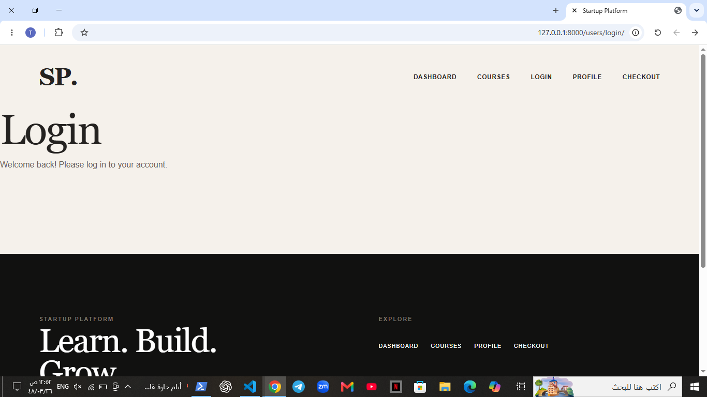
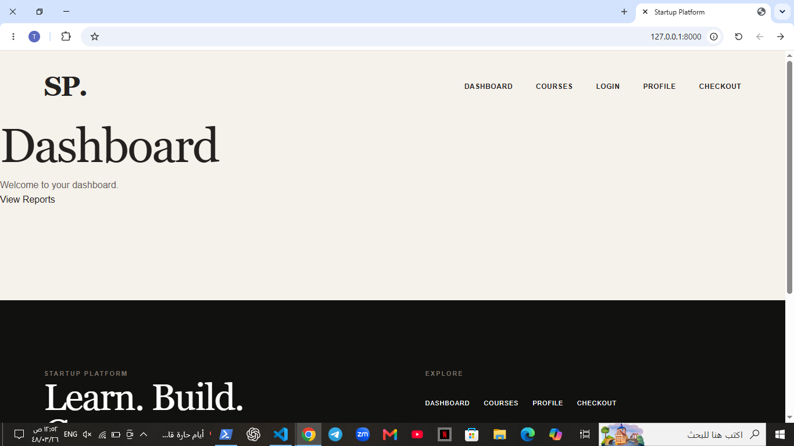
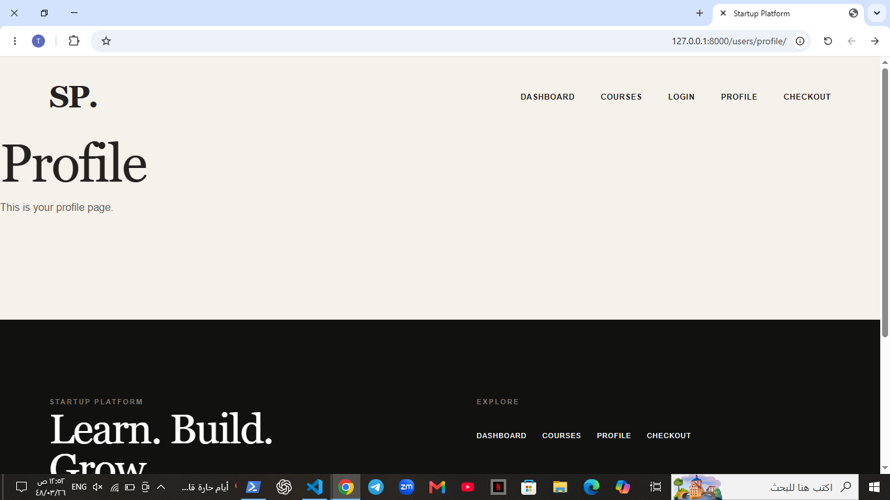
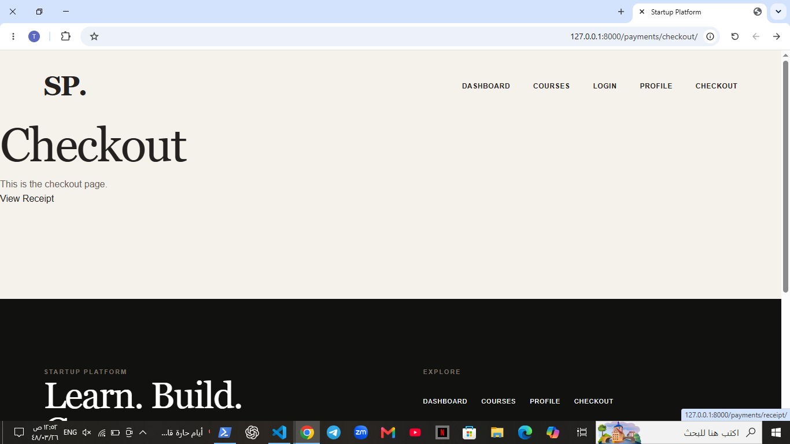
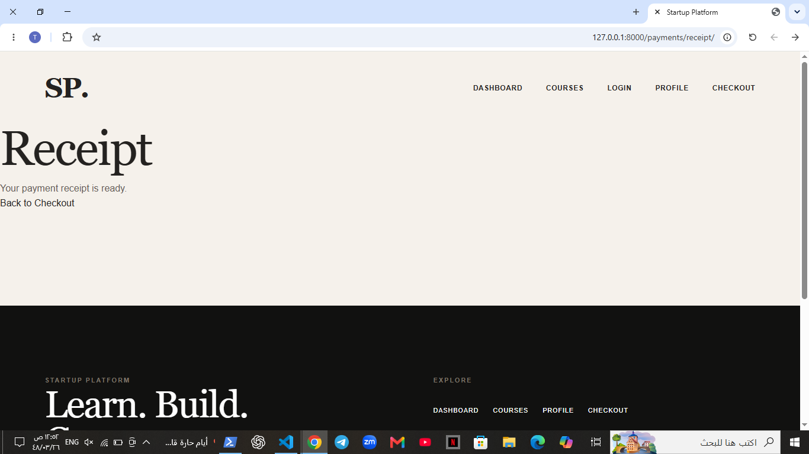

# Startup Platform

A Django-based web platform designed to provide an online learning experience where users can browse courses, view course details, manage their profiles, and complete course purchases.

## 📌 Project Overview

Startup Platform is a web application built using Django. The platform provides different features for learners and administrators, including course management, user authentication, dashboards, and payment handling.

The project is structured into multiple Django applications, where each application is responsible for a specific part of the system.

## ✨ Features

- User registration and authentication
- User login and logout
- User profile management
- Browse available courses
- View course categories
- View detailed course information
- Course purchasing and checkout
- Payment management
- Payment receipts
- User dashboard
- Reports and statistics
- Responsive web interface
- Django template inheritance using a base template

## 🛠️ Technologies Used

- Python
- Django
- HTML5
- CSS3
- JavaScript
- SQLite
- Django Templates

## 📂 Project Structure

```text
startup_platform/
│
├── courses/
│   ├── models.py
│   ├── views.py
│   ├── urls.py
│   └── ...
│
├── dashboard/
│   ├── models.py
│   ├── views.py
│   ├── urls.py
│   └── ...
│
├── mysite/
│   ├── settings.py
│   ├── urls.py
│   ├── asgi.py
│   └── wsgi.py
│
├── payments/
│   ├── models.py
│   ├── views.py
│   ├── urls.py
│   └── ...
│
├── users/
│   ├── models.py
│   ├── views.py
│   ├── urls.py
│   └── ...
│
├── templates/
│   ├── base.html
│   ├── home.html
│   ├── login.html
│   ├── profile.html
│   ├── category.html
│   ├── course_info.html
│   ├── checkout.html
│   ├── receipt.html
│   ├── reports.html
│   └── ...
│
├── db.sqlite3
├── manage.py
└── README.md

## 📸 Screenshots

### Login


### Dashboard


### Profile


### Checkout


### Receipt


### Footer
