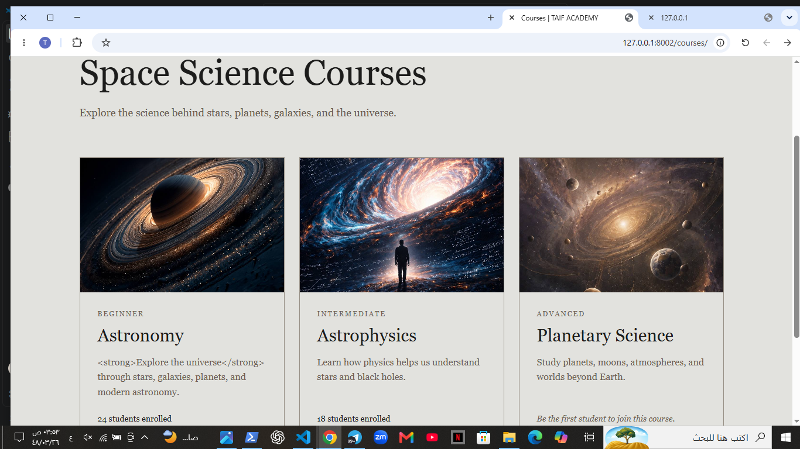

 # 🌌 The Lab — Dynamic Multi-Page Website

A Django-based multi-page website built during **Week 7 — Day 2** of the Python Web Development Bootcamp.

The project focuses on building dynamic pages using Django templates, reusable components, template inheritance, named URLs, and static files.

## ✨ Features

- 🏠 Home page
- 📚 Courses page
- 🔎 Course detail pages
- 🧩 Reusable course card component
- 🧱 Shared base template with template inheritance
- 🔗 Navigation using named Django URLs
- 🎨 Custom CSS styling
- 🖼️ Static images and assets

## 🛠️ Technologies

- Python
- Django
- HTML5
- CSS3
- Django Templates

## 📁 Project Structure

```text
thelab/
│
├── core/
│   ├── templates/
│   │   └── core/
│   │       ├── home.html
│   │       ├── courses.html
│   │       ├── course_detail.html
│   │       └── course_card.html
│   │
│   ├── urls.py
│   └── views.py
│
├── static/
│   ├── css/
│   │   └── style.css
│   │
│   └── images/
│       ├── astronomy.jpg
│       ├── astrophysics.jpg
│       └── planetary-science.jpg
│
├── templates/
│   └── base.html
│
├── thelab/
│   ├── settings.py
│   ├── urls.py
│   ├── asgi.py
│   └── wsgi.py
│
├── manage.py
└── requirements.txt
```

## 📸 Project Screenshots

### 🏠 Home Page


### 📚 Courses Page



### 🔎 Course Detail


## 🚀 Run Locally

```bash
pip install -r requirements.txt
python manage.py runserver
```

Then open the local development server in your browser.

---


## 📸 Project Screenshots

### 🏠 Home Page

%20لقطة%20الشاشة.png)

### 📚 Courses Page

%20لقطة%20الشاشة.png)

### 🔎 Course Detail

%20لقطة%20الشاشة.png)

### 🧩 Course Card

%20لقطة%20الشاشة.png)

### 🌌 Project Page

%20لقطة%20الشاشة.png)

### 🖥️ Website Preview

%20لقطة%20الشاشة.png)

### ✨ Final Preview

%20لقطة%20الشاشة.png)

**Python Web Development Bootcamp — Week 7, Day 2**