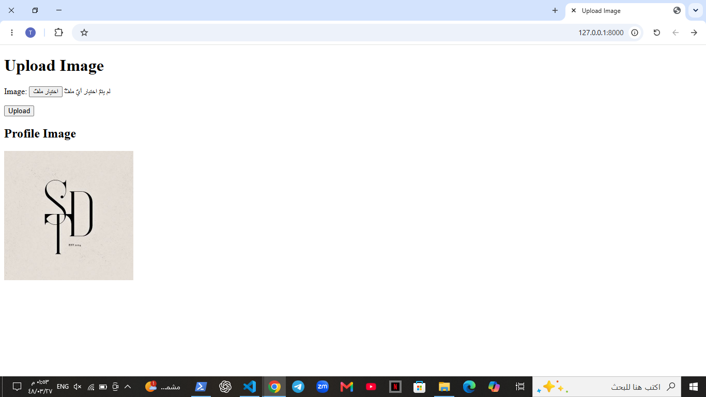

# Static & Media-Aware Django Site

A Django project built as part of the **Python Web Development Bootcamp – Week 7, Day 3**.

This project demonstrates how Django handles **static files and user-uploaded media**, including static CSS/images, media configuration, image uploads, file validation, and displaying uploaded images with a fallback static image.

---

## 🚀 Project Overview

The project includes a simple image upload page where users can upload a profile image.

It demonstrates the difference between:

- **Static files** → CSS and default images included with the project.
- **Media files** → Images uploaded by users at runtime.

---

## 🛠️ Technologies

- Python
- Django
- HTML
- CSS
- Pillow

---

## 📌 Features

- Django static files configuration
- Custom CSS styling
- Default static profile image
- User image uploads
- Media files configuration
- Multipart form handling
- `request.FILES`
- Image file validation
- Uploaded image display
- Fallback to a default static image
- `collectstatic` for production-ready static files

---

## 📁 Project Structure

```text
staticmedia/
│
├── media/
│   └── uploads/
│
├── static/
│   ├── css/
│   │   └── main.css
│   │
│   └── images/
│       └── default-avatar.png
│
├── templates/
│   └── upload.html
│
├── staticmedia/
│   ├── settings.py
│   └── urls.py
│
├── manage.py
└── requirements.txt

```

## 📸 Project Screenshot
