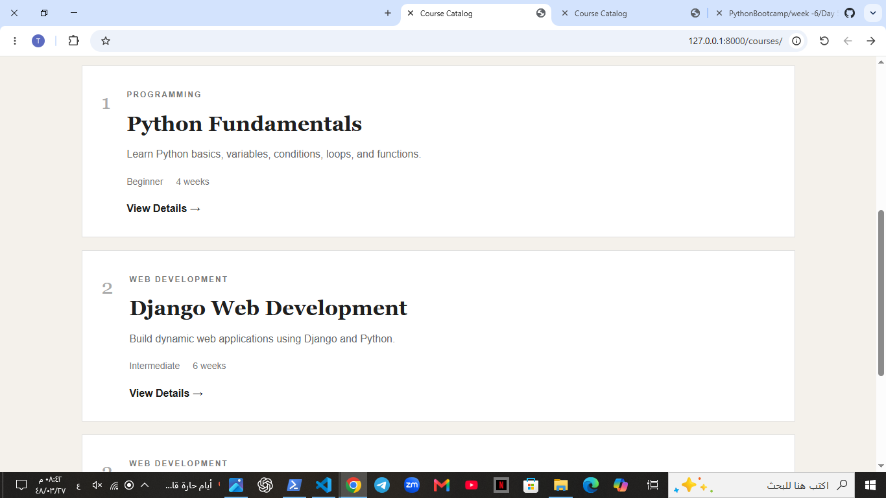
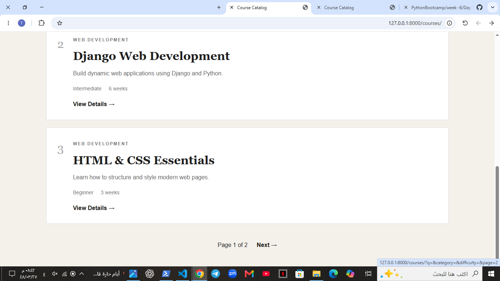
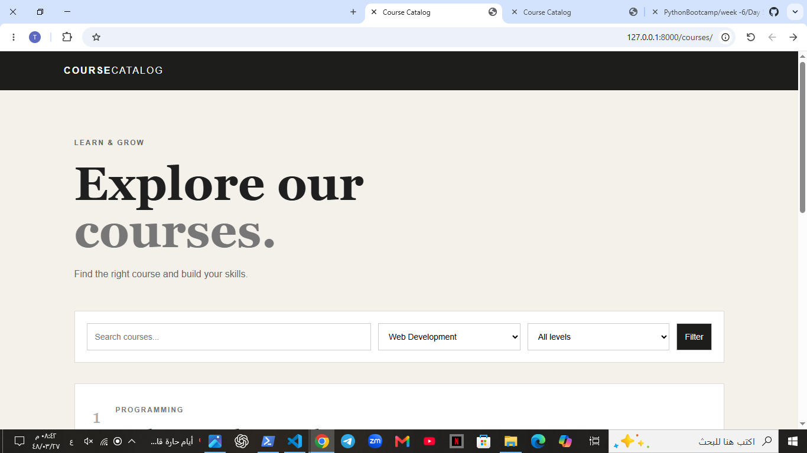
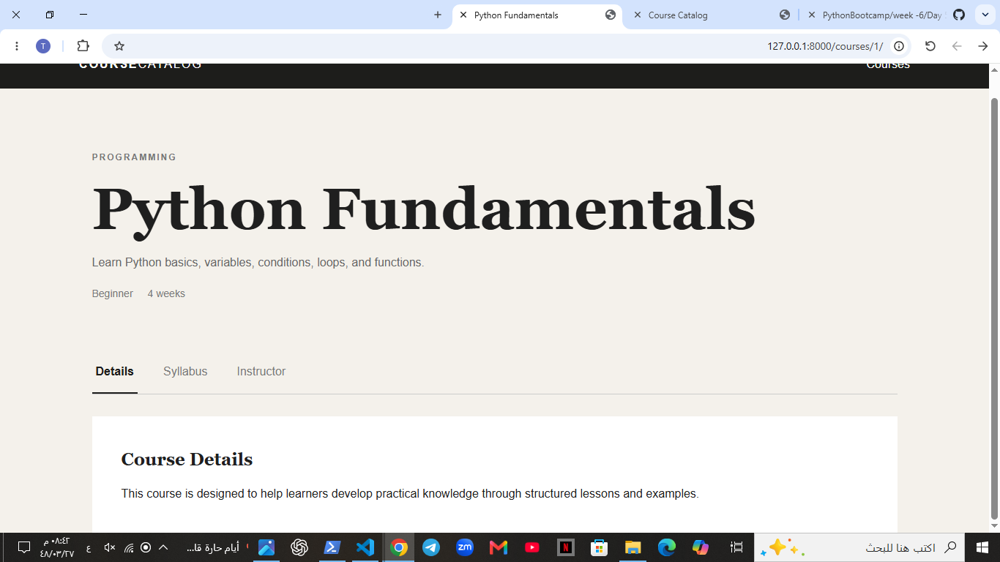
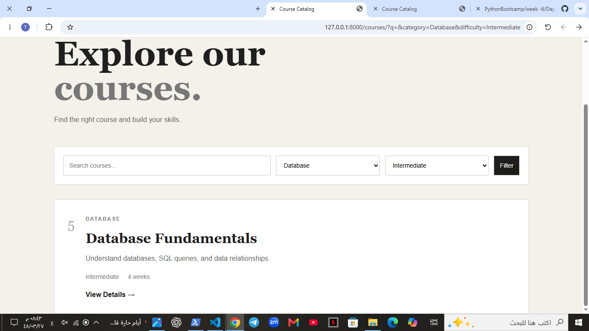

# Course Catalog

A Django web application for browsing and exploring courses with search, filtering, URL parameters, tabs, and pagination.

## ✨ Features

- Browse a list of courses.
- Search courses using a GET form.
- Filter courses by category and difficulty.
- Use URL query parameters to control page state.
- View individual course details using dynamic URL parameters.
- Switch between course detail tabs.
- Navigate through courses using pagination.
- Handle missing and invalid parameter values safely.
- Use Django URL names and `` for dynamic links.

## 🛠️ Technologies

- Python
- Django
- HTML
- CSS

## 📁 Project Structure

```text
coursecatalog/
│
├── courses/
│   ├── migrations/
│   ├── templates/
│   ├── admin.py
│   ├── apps.py
│   ├── models.py
│   ├── tests.py
│   ├── urls.py
│   └── views.py
│
├── coursecatalog/
│   ├── settings.py
│   ├── urls.py
│   ├── asgi.py
│   └── wsgi.py
│
├── static/
│   └── css/
│       └── courses.css
│
├── screenshots/
│   ├── course-list.png
│   ├── course-search.png
│   ├── course-filter.png
│   ├── course-detail.png
│   └── course-tabs.png
│
├── manage.py
├── db.sqlite3
└── requirements.txt
```

## 🚀 Run the Project

```bash
python manage.py runserver
```

Then open the local development server in your browser.

## 📸 Screenshots









