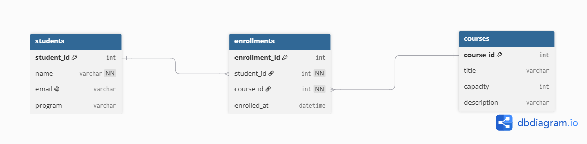

# Course Registration Database

## Overview

This project designs a relational database structure for a course registration system.

The database consists of three main entities:

- **Students** – stores student information.
- **Courses** – stores course information.
- **Enrollments** – connects students with the courses they are enrolled in.

## Database Design

### Students

- `student_id` – Primary Key
- `name` – Student name
- `email` – Student email (Unique)
- `program` – Student program

### Courses

- `course_id` – Primary Key
- `title` – Course title
- `capacity` – Maximum number of students
- `description` – Course description

### Enrollments

- `enrollment_id` – Primary Key
- `student_id` – Foreign Key → Students
- `course_id` – Foreign Key → Courses
- `enrolled_at` – Enrollment date and time

## Relationships

- One Student can have many Enrollments.
- One Course can have many Enrollments.
- Students and Courses have a many-to-many relationship through Enrollments.

## Constraints

- `student_id` is the Primary Key in Students.
- `course_id` is the Primary Key in Courses.
- `enrollment_id` is the Primary Key in Enrollments.
- `email` must be Unique.
- `name` cannot be NULL.
- `student_id` and `course_id` in Enrollments are Foreign Keys.

## ER Diagram

## Why use Enrollment?

The Enrollment table connects Students and Courses without repeatedly storing the student's name or the course title.

This reduces duplicated data and helps keep the database consistent.