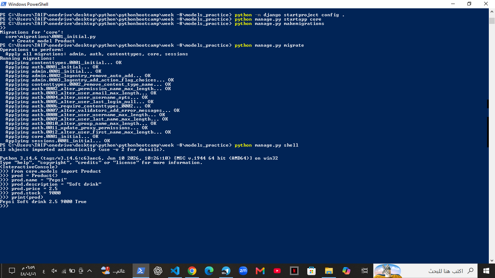

# Django Models Practice

## Product Model

This project demonstrates creating a Django `Product` model and working with a model instance using the Django Shell.

### Django Shell

The following screenshot shows the model import, instance creation, assigning values, and the final output:

 "